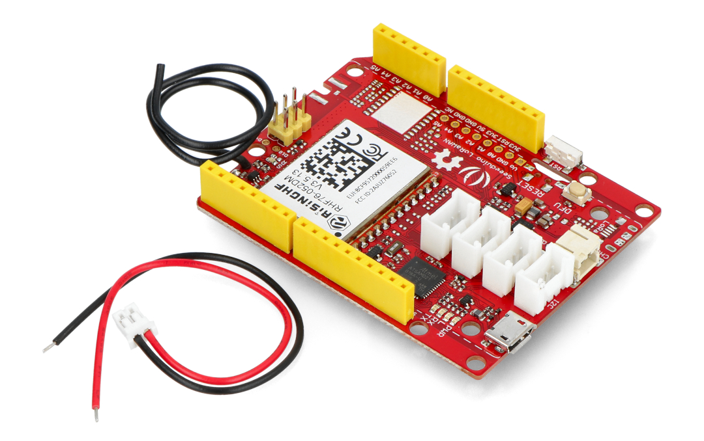
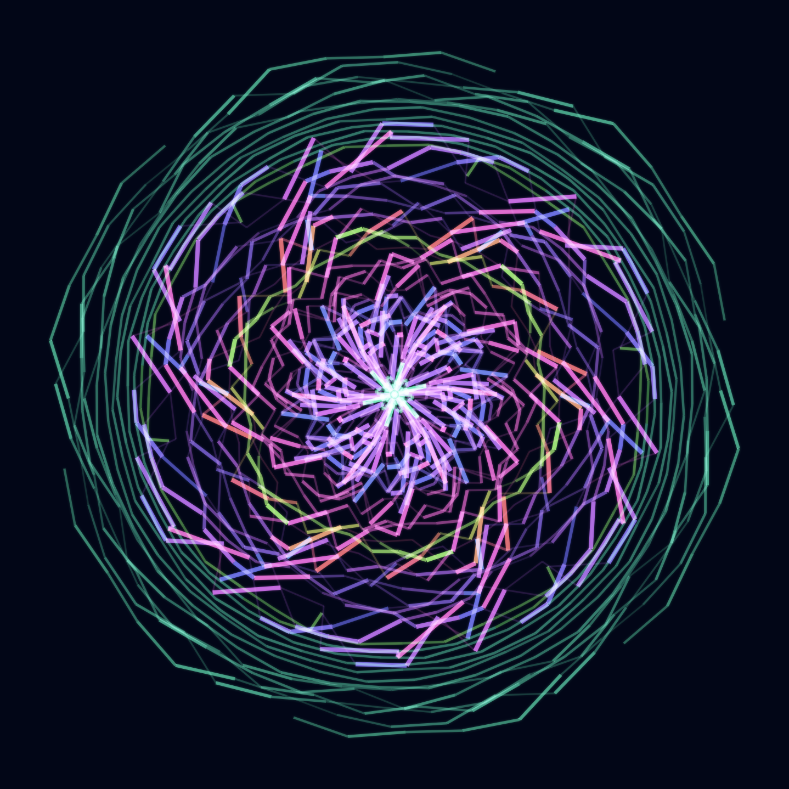

<!-- _class: logo-slide -->


---
<!-- _class: title-slide -->


# SMART CITY DATA COLLECTOR
<p>Introduction & Kickoff • Rotterdam, 2026</p>

---

# PROJECT OVERVIEW

## What are we going to do?

During this project, you will transform from a designer into a hardware hacker and data artist. We are heading into the city to make invisible data visible.

* **Phase 1:** Build your custom sensor kit (Hardware)
* **Phase 2:** Generate low-code logic via the GLR Configurator (Software)
* **Phase 3:** Extract data in the city (Fieldwork)
* **Phase 4:** Visualize your dataset (Data to Design)

---
<!-- _class: chapter -->


# 1. THE HARDWARE

---

# PLUG & PLAY SENSORS

<div class="columns">

<div>

## No soldering iron needed

We use the **Seeeduino LoRaWAN** with built-in GPS. With the Grove connectors, you simply "click" your sensors together.

* **A0 & A2 (Analog):** Light, Sound, Temperature, or Rotary Angle Sensors.
* **D2 (Digital):** Push Buttons, Distance Sensors, or Humidity.
* **I2C (Data Bus):** 3-Axis & 6-Axis motion, rotation, and G-forces.

</div>

<div>

<!-- Vervang image13.png door een mooie productfoto van de sensoren -->


</div>

</div>

---

# HARDWARE ASSEMBLY STEPS

<div class="columns">

<div>

## Step-by-Step Setup

1. **Antennas First!**
   Always connect the LoRa and GPS antennas *before* providing power to prevent transmitter damage.
2. **Connect Sensors**
   Map your chosen sensors to the correct ports (A0, A2, D2, or I2C) using the white cables.
3. **USB Connection**
   Connect the device to your laptop via Micro-USB. You are now ready for the software phase.

</div>

<div>


</div>

</div>

---
<!-- _class: chapter -->


# 2. THE SOFTWARE

---

# THE GLR CONFIGURATOR

<div class="columns">

<div>


</div>

<div>

## Low-Code Development

You don't need to write complex C++ yourself. We have built a custom web portal designed specifically for designers.

The platform instantly generates the necessary logic, handles the sensor data formatting, and automatically builds in the network fallback protocols.

</div>

</div>

---

# SOFTWARE DEPLOYMENT STEPS

<div class="columns">

<div>

## 1. Configure & Compile
* Open the GLR Configurator portal.
* Select your physical sensors in the dropdown menus.
* Paste your unique **TTN Keys** (from the shared document on the board) into the fields.
* Click **Compile & Generate Code**.

</div>

<div>

## 2. Arduino IDE & Upload
* Copy the generated code.
* Paste it into a blank sketch in the **Arduino IDE**.
* Install the required libraries listed on the portal (e.g., TinyGPSPlus, BMI088).
* Click **Upload** to flash the firmware to your device.

</div>

</div>

---
<!-- _class: chapter -->


# 3. FIELDWORK

---

# YOUR BLACK BOX

<div class="columns">

<div>

## Offline-First Architecture

During your walk, the device extracts and saves your GPS location, the exact time, and all your sensor values **every 15 seconds**.

Even if the LoRaWAN network drops, the device continues logging to its internal memory. 

> **CRUCIAL WARNING:** Never disconnect the battery until you have downloaded your data back at school!

</div>

<div>

# 15s

### Logging interval

</div>

</div>

---
<!-- _class: chapter -->


# 4. DATA TO DESIGN

---

# DATA EXTRACTION

<div class="columns">

<div>

## The Raw Input

Back at school, plug the USB cable into your laptop and click **Download CSV** in the portal. The data rolls out perfectly structured:

```csv
Time_UTC,Latitude,Longitude,A0_Light_Sensor,A2_Sound_Sensor,BMI_X,BMI_Y,BMI_Z
00:00:00,0.00000,0.00000,65.6,27.7,1.42,9.40,-2.81
14:16:42,51.90370,4.48396,65.6,27.4,1.39,9.40,-2.77
14:17:28,51.90371,4.48401,65.7,40.1,1.31,9.29,-2.85
14:17:53,51.90371,4.48404,65.6,34.2,1.35,9.47,-2.79
14:18:18,51.90369,4.48405,65.7,52.4,1.39,9.39,-2.84
14:18:43,51.90371,4.48405,65.7,45.6,1.43,9.34,-2.85
14:19:08,51.90371,4.48406,65.6,48.9,1.38,9.45,-2.86
14:19:33,51.90372,4.48408,65.6,22.1,1.33,9.30,-2.81
14:19:58,51.90372,4.48409,65.7,40.2,1.29,9.41,-2.87
14:20:23,51.90374,4.48407,65.7,33.1,1.35,9.45,-2.87
14:20:48,51.90374,4.48406,65.7,32.5,1.33,9.37,-2.79
14:21:13,51.90373,4.48407,65.7,67.4,1.36,9.40,-2.83
14:21:38,51.90374,4.48407,65.8,25.1,1.34,9.40,-2.84
14:22:03,51.90377,4.48405,65.7,42.1,1.42,9.41,-2.86
```
*No complex data cleaning needed anymore!*

</div>

<div>



</div>

</div>

---

## Design Ready

Import your CSV directly into **Kepler.gl** for instant, geospatial 3D mapping of your route.

Alternatively, link your dataset to **Adobe After Effects** using Data-Driven Animation to control scale, opacity, and color. The numbers dictate your design!

---
<!-- _class: closing -->

# LET'S GO! ANY QUESTIONS?

---
<!-- _class: closing -->
# https://loos.sd-lab.nl