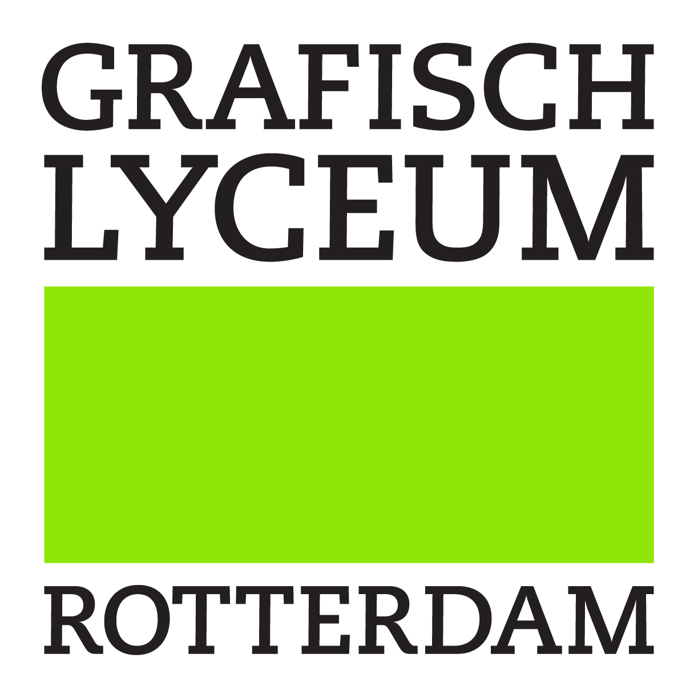
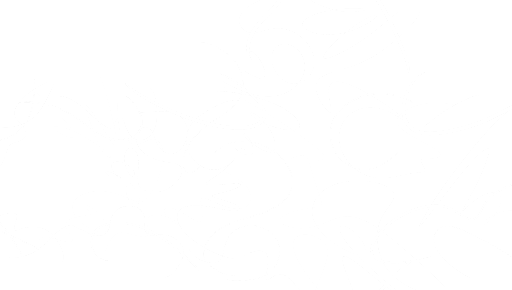
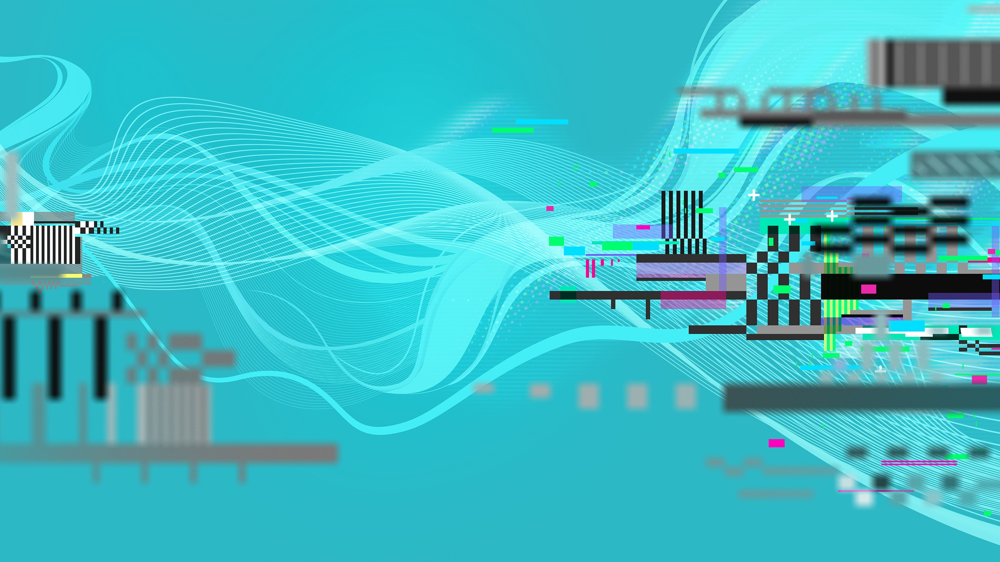
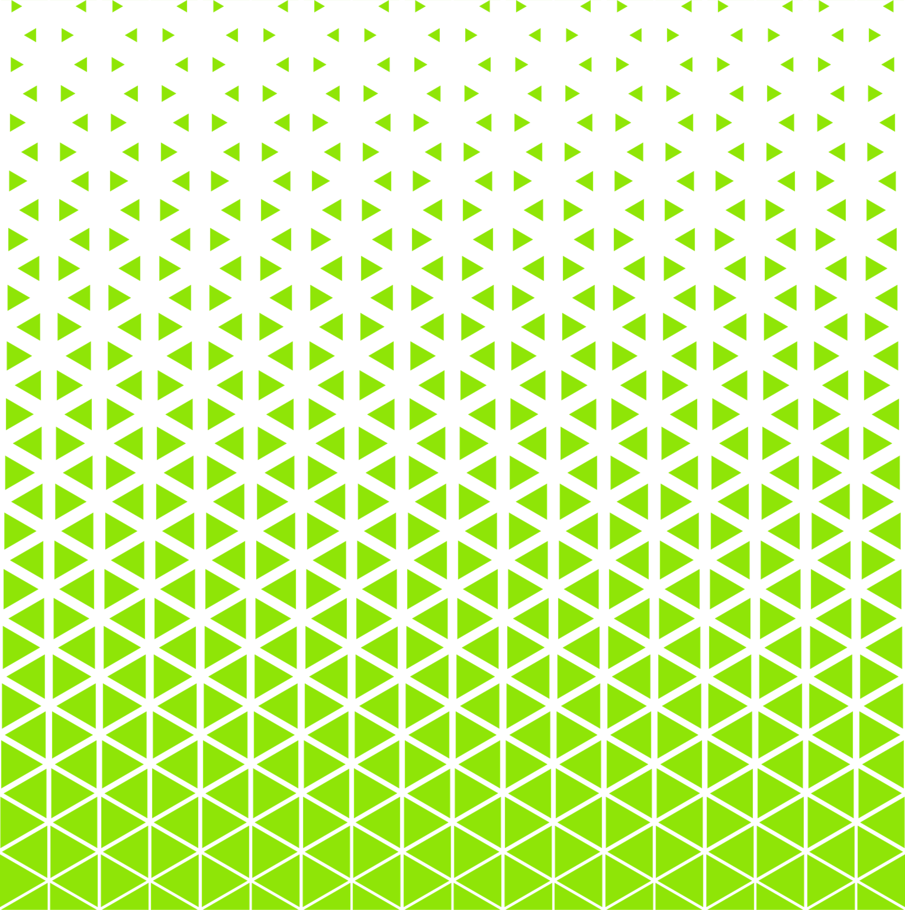
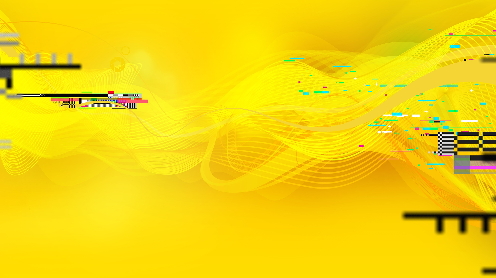
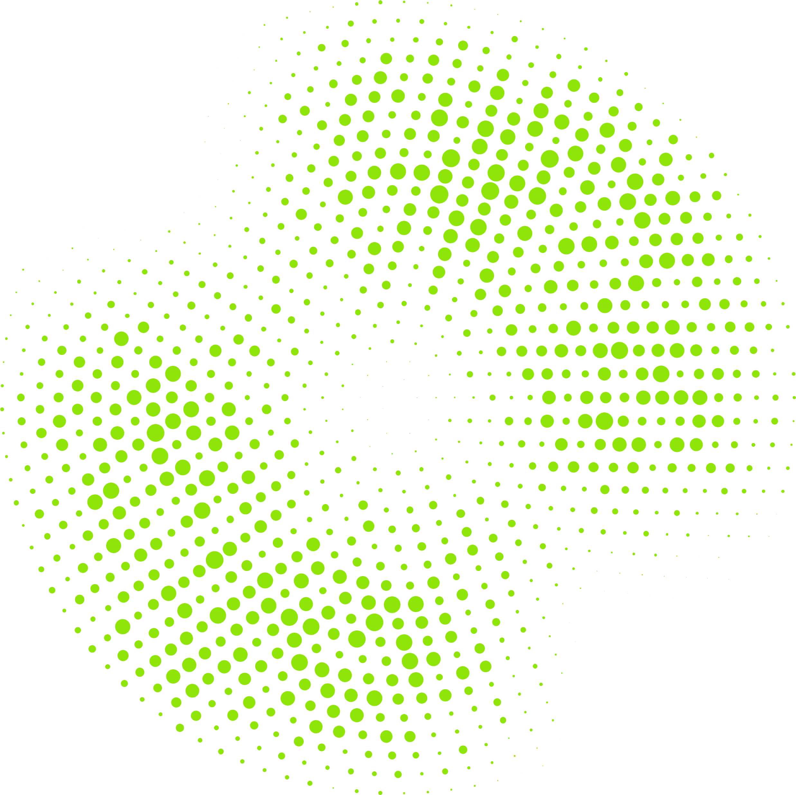
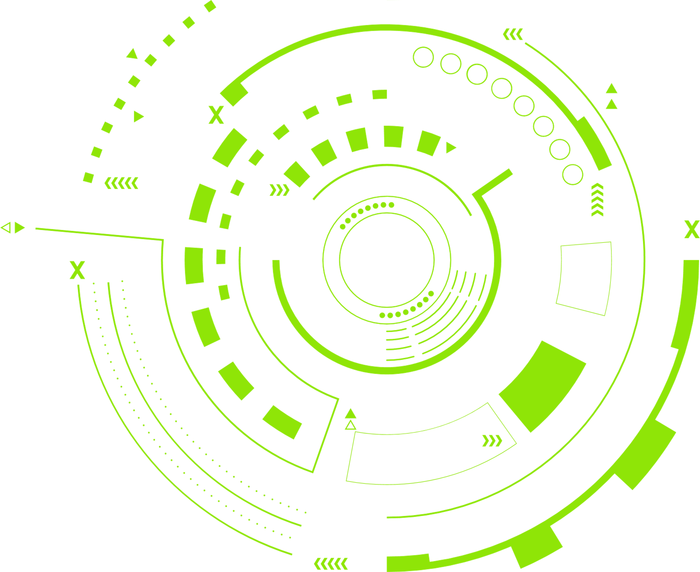

<!-- _class: logo-slide -->

---

# SMART CITY DATA COLLECTOR
### Introduction & Kickoff • Rotterdam, 2026

---

# OVERVIEW

## What are we going to do?

During this project, you will transform from a designer into a hardware hacker and data artist. We are heading into the city to make invisible data visible.

* **Part 1:** Build your own sensor kit (Hardware)
* **Part 2:** Generate your code via the GLR Configurator (Software)
* **Part 3:** Fieldwork in Rotterdam (Data Collection)
* **Part 4:** Visualize your dataset (Design)

> **The Goal:** Use real environmental data to create an interactive or graphic design that tells a story about the city.

---

# 1. THE HARDWARE

---

# PLUG & PLAY SENSORS

## No soldering iron needed

We use the **Seeeduino LoRaWAN** with built-in GPS. With the Grove connectors, you simply "click" your sensors together.

* **A0 & A2 (Analog):** Light, Sound, Temperature, or a Rotary Angle Sensor.
* **D2 (Digital):** Push Buttons, Distance Sensors, or Humidity.
* **I2C:** G-forces and Motion.

Choose the sensors that fit your concept!

---

# 2. THE SOFTWARE

---

# THE GLR CONFIGURATOR

## Low-Code Development

You don't need to write complex math or C++ yourself. We have built a web portal for you.

1. **Choose your sensors** in the dropdown menus.
2. The portal writes the **custom code instantly and live**.
3. Copy the code to the **Arduino IDE**.
4. Click Upload. You are ready to go outside!

---

# 3. FIELDWORK & DATA

---

# YOUR BLACK BOX

## Data Extraction

During your walk, the device saves your GPS location, the time, and your sensor values every 15 seconds.

Back at school, plug the USB cable into your laptop. Open tab 2 in the web portal and click **Download CSV**.

The raw data rolls out perfectly usable: in degrees Celsius, percentages, and centimeters.

---

# DESIGN READY DATA

## From CSV to Visualization

The data you download is immediately "Design Ready". No complex data cleaning is needed anymore.

* **Kepler.gl:** Drag and drop your CSV into the browser for instant interactive 3D maps based on your GPS coordinates.
* **Adobe Illustrator / After Effects:** Link your measurements to visual elements (color, scale, transparency) using scripts or data-driven graphics.

Let the numbers drive the design!

---

# LET'S GO! ANY QUESTIONS?