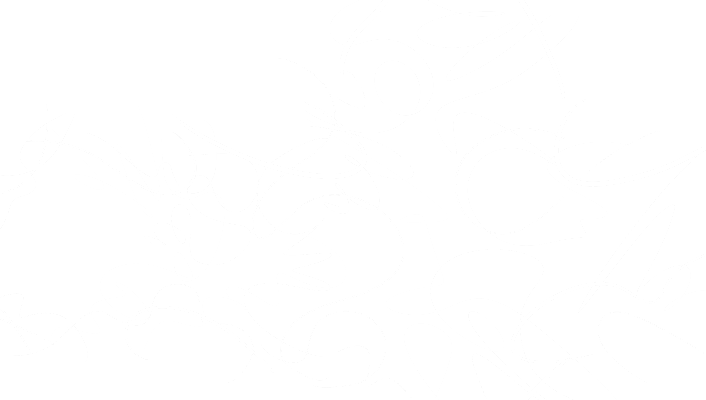
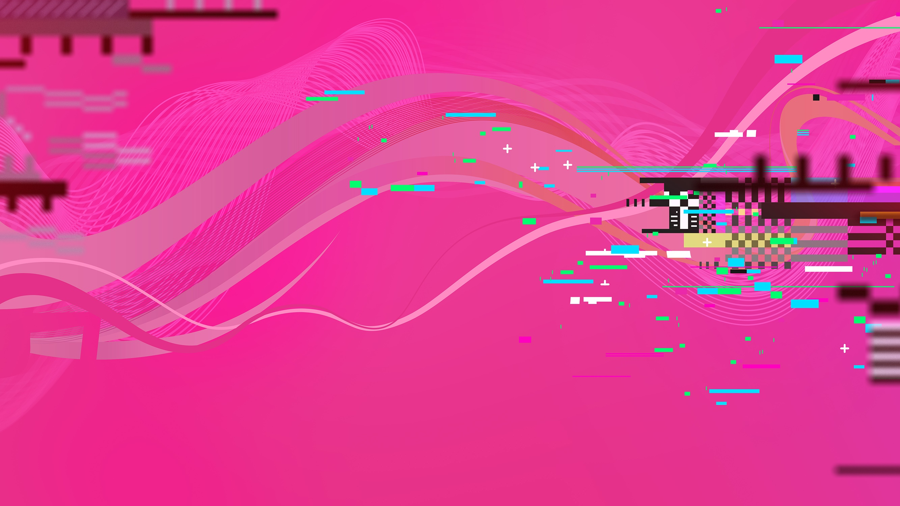
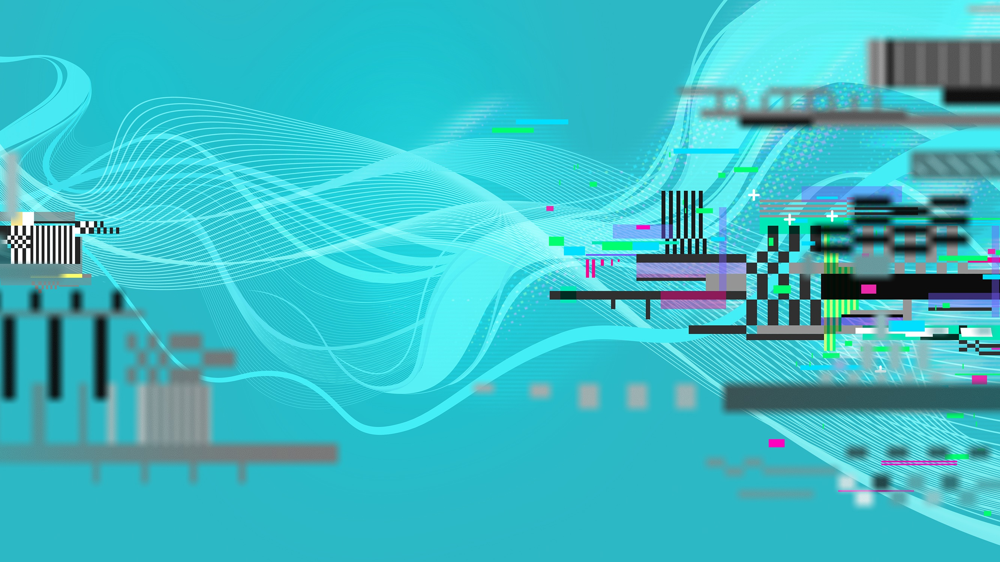
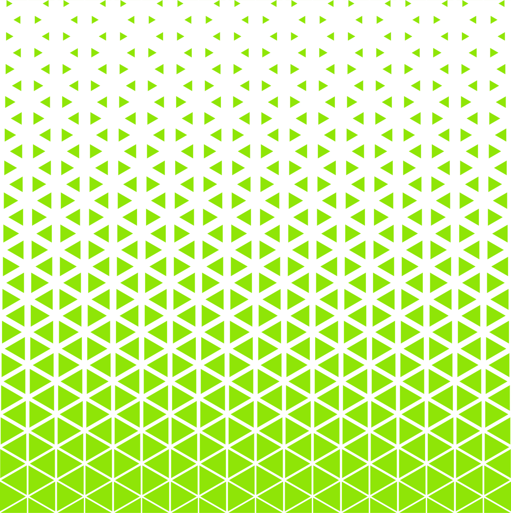

<!-- _class: logo-slide -->

---

<!-- _class: title-slide -->

# Plaats hier je titel
### Rotterdam, 2024

---

# OVERZICHT

## Wat gaan we doen?

Hier kun je de structuur van de les of presentatie neerzetten.

* Welkomstwoord
* Terugblik vorige module
* Nieuwe technieken (C# / .NET)
* Opdracht briefing

> **Pedagogisch doel:** Door vooraf structuur te bieden, verlagen we de cognitieve belasting voor de student.

---

<!-- _class: chapter -->

# DE THEORIE

---

# TEKST + VISUAL

## Focus in de les

In deze module focussen we op samenwerking in Agile teams. Zoals je rechts ziet, werken studenten vaak in duo's (pair programming).

* Communicatie
* Versiebeheer (Git)
* Code reviews

---

# VISUAL + UITLEG

## Hands-on

We gaan direct aan de slag. De theorie is ondersteunend, de praktijk is leidend.

1.  Clone de repo
2.  Maak een nieuwe branch
3.  Implementeer de feature

`git checkout -b feature/nieuwe-les`

---

<!-- _class: closing -->

# VRAGEN?